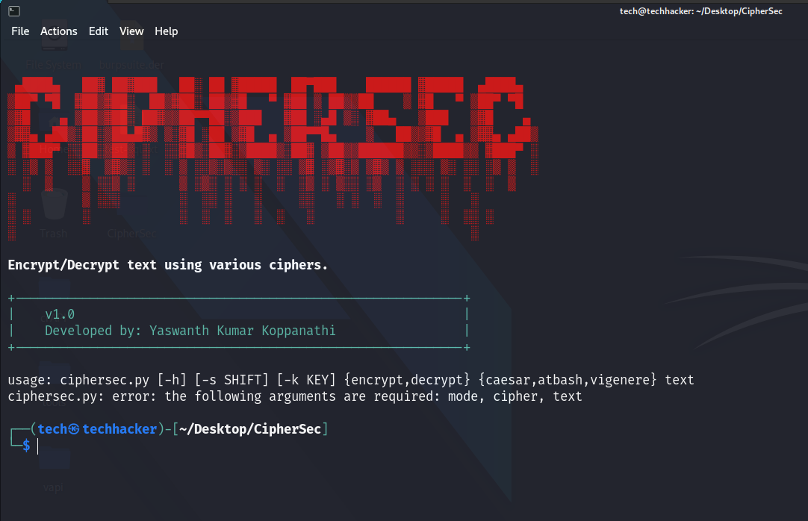

# CipherSec
CipherSec is an open-source and free Python based tool capable of encrypting and decrypting text using Caesar, Atbash, and Vigenere ciphers.



## Installation
You need to have Python3

```bash
sudo apt-get install python3
```

Downloading and setting up tool:

```bash
git clone https://github.com/Yash0x01/CipherSec.git
cd CipherSec
pip3 install -r requirements.txt
```

## Usage

```bash
usage: ciphersec.py [-h] [-s SHIFT] [-k KEY] {encrypt,decrypt} {caesar,atbash,vigenere} text

Encrypt or decrypt text using various ciphers.

positional arguments:
  {encrypt,decrypt}     Mode: encrypt or decrypt
  {caesar,atbash,vigenere}
                        Cipher: caesar, atbash, or vigenere
  text                  Text to be processed

options:
  -h, --help            show this help message and exit
  -s SHIFT, --shift SHIFT
                        Shift Key for Caesar cipher
  -k KEY, --key KEY     key for Vigenere cipher

Example - python3 ciphersec.py decrypt caesar "Kvu'a mvynla av mvssvd Fhzo0e01 vu NpaObi!" -s 7
```

## Encryption / Decryption Methods
1. Caesar Cipher
2. Atbash Cipher
3. Vigenere Cipher

Examples:
```bash
Encryption:
Caesar Cipher: python3 ciphersec.py encrypt caesar "Hello World" -s 5
Atbash Cipher: python3 ciphersec.py encrypt atbash "Hello World"
Vigenere Cipher: python3 ciphersec.py encrypt vigenere "Hello World" -k key

Decryption:
Caesar Cipher: python3 ciphersec.py decrypt caesar "Mjqqt Btwqi" -s 5
Atbash Cipher: python3 ciphersec.py decrypt atbash "Svool Dliow"
Vigenere Cipher: python ciphersec.py decrypt vigenere "Rijvs Uyvjn" -k key
```
Please report any functionality issues and bugs.

## License
[GNU GPLv3](https://www.gnu.org/licenses/gpl-3.0.en.html)

